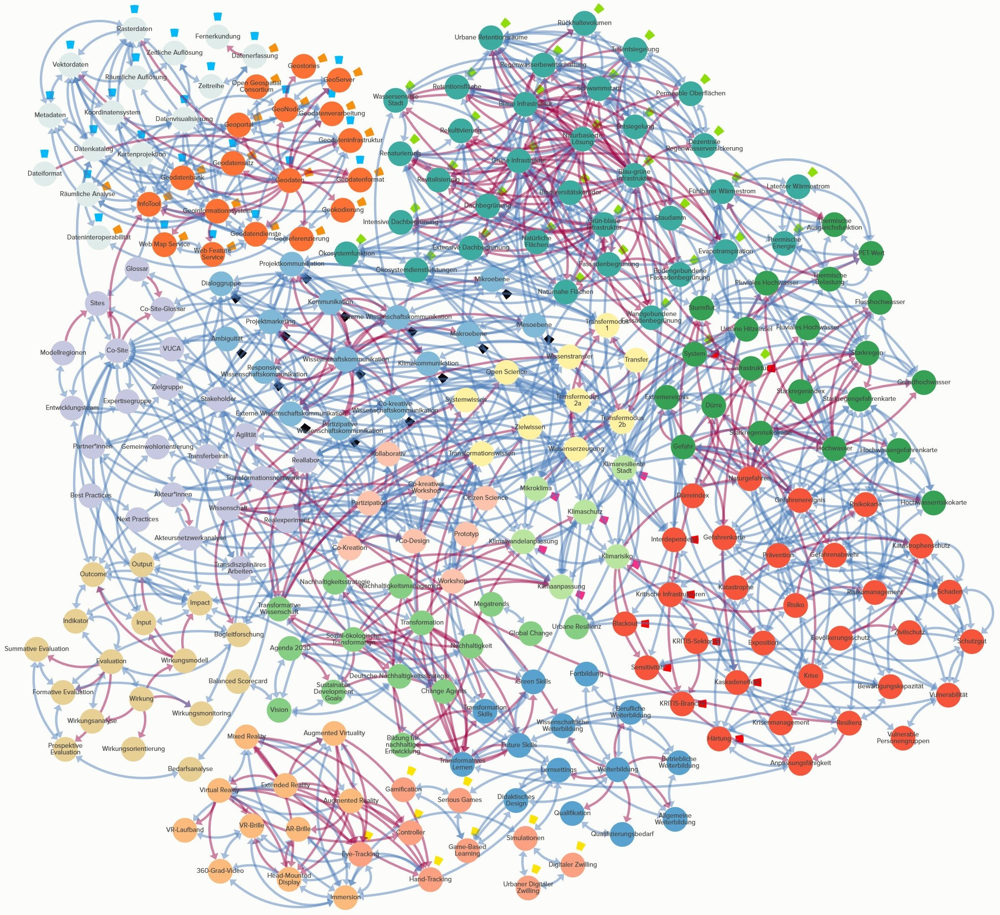

```{=latex}
\begin{figure}[b!]
  \raggedleft
  \begin{subfigure}[b]{0.2\linewidth}
    \includegraphics[width=\linewidth]{images/innovative-hochschule.png}
  \end{subfigure}
  \raggedleft
  \begin{subfigure}[b]{0.2\linewidth}
    \includegraphics[width=\linewidth]{images/bmbf-logo-ohne-gefordert.png}
  \end{subfigure}
\end{figure}
```

